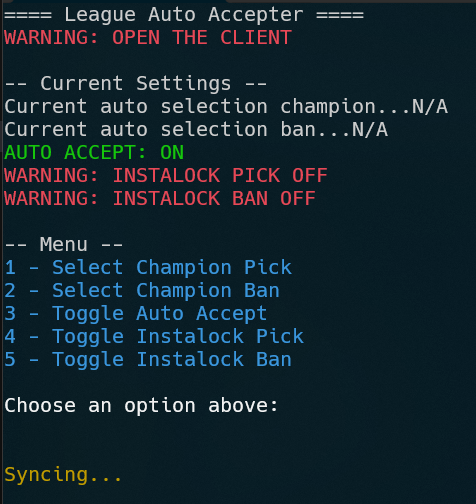

## Win32 API cli-based League of Legends auto accepter

> [!IMPORTANT]
> This is currently a work in progress, expect things to be broken!

## TODO

Implement
- `1 - Select Champion Pick`
- `2 - Select Champion Ban`

> [!NOTE]
> - `4 - Toggle Instalock Pick`
> - `5 - Toggle Instalock Ban`
> 
> The above functions will work but depends on `1` and `2` features that are not implemented yet.

## 🌅 View 

> 1.0.0 Release
> 

## ✨ Requirements
`mscoree.dll` - already shipped with Windows

## 📦 Installation

Download `lol_auto_accept.exe` in the `Releases` section and run it.

## 🚀 Usage

Just make sure the option `3` is on. `Auto Picker` and `Auto Banner` are both optional.

>[!NOTE]
> This project is maintained by external documentation rather than Riot Games'. They do not support official documentation. And i'm not responsible for consequences of the program usage.
>
> The program does not store any user data and the code is open to analysis.

## LICENSE

MIT
